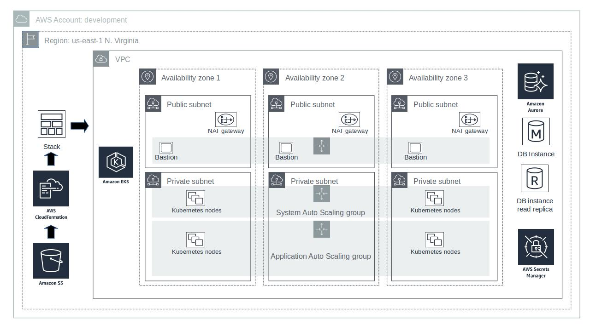

# BusyCloud AWS Infrastructure
AWS code for managing AWS resources required for Kubernetes managed application services that use an Aurora database cluster.

## BusyCloud CloudFormation Templates

### Installation
- Copy the assets to S3.
```
aws s3 sync ./ s3://development-busycloud/assets
```
- Create a stack with the master template
```
aws cloudformation create-stack --stack-name "development-busycloud" --template-url https://s3.amazonaws.com/development-busycloud/assets/templates/amazon-eks-master.template.yaml --capabilities CAPABILITY_IAM --disable-rollback --parameters ParameterKey=AvailabilityZones,ParameterValue='us-east-1b\,us-east-1e\,us-east-1d' ParameterKey=RemoteAccessCIDR,ParameterValue=70.112.246.130/32 ParameterKey=KeyPairName,ParameterValue=busycloud-dev ParameterKey=QSS3BucketName,ParameterValue=development-busycloud ParameterKey=QSS3KeyPrefix,ParameterValue=assets\/ ParameterKey=Cluster,ParameterValue=development ParameterKey=Environment,ParameterValue=dev

```
### Update Template
```
aws cloudformation update-stack --stack-name "development-busycloud" --template-url https://s3.amazonaws.com/development-busycloud/assets/templates/amazon-eks-master.template.yaml --capabilities CAPABILITY_IAM --parameters ParameterKey=AvailabilityZones,ParameterValue='us-east-1b\,us-east-1e\,us-east-1d' ParameterKey=RemoteAccessCIDR,ParameterValue=70.112.246.130/32 ParameterKey=KeyPairName,ParameterValue=busycloud-dev ParameterKey=QSS3BucketName,ParameterValue=development-busycloud ParameterKey=QSS3KeyPrefix,ParameterValue=assets\/ ParameterKey=Cluster,ParameterValue=development ParameterKey=Environment,ParameterValue=dev
```
### Deployed Resources

#### EKS
In addition to EKS to manage the Kubernetes control plane, EC2 worker nodes are required to host application containers and several other Kubernetes services are required to support monitoring and horizontal scaling.
##### 1. Worker Nodes
* amazon-eks-node-1.12-v20190329 - ami-0abcb9f9190e867ab

##### 2. VPC CNI plugin
```
kubectl describe daemonset aws-node --namespace kube-system | grep Image | cut -d "/" -f 2
kubectl apply -f https://raw.githubusercontent.com/aws/amazon-vpc-cni-k8s/master/config/v1.3/aws-k8s-cni.yaml
```

##### 3. Ingress Controller
Kubernetes defines an ingress controller specification to allow Kubernetes managed services to be exposed as externally acceptable network endpoints.
All ingress controllers implementing the specification should support the same Kubernetes features. EKS recommends the [alb-ingress-controller](https://github.com/kubernetes-sigs/aws-alb-ingress-controller) which dynamically creates AWS ALBs to expose externally accessible endpoints.
The alb-ingress-controller should be preffered as it is able to take advantage of ALB features that aren't available with ELB. AWS has also indicated that ELBs may not be supported in the future.

##### 4. [Helm](https://helm.sh/) Tiller
Helm will be used to deploy each of the add-on Kubernetes services. Tiller is the back-end component of the Helm application package manager.

##### 5. Kubernetes Dashboard
Web UI used to browse Kubernetes namespaces and objects.

##### 6. [Metrics Server](https://github.com/helm/charts/tree/master/stable/metrics-server)
A cluster-wide aggregator of resource usage data. Resource metrics are used by the Horizontal Pod Autoscaler to scale workloads.

##### 7. [Prometheus Resource Monitor](https://github.com/helm/charts/tree/master/stable/prometheus)

##### 8. [Cluster Autoscaler](https://github.com/kubernetes/autoscaler/tree/master/cluster-autoscaler)
Scales worker nodes within an AWS autoscaling group (ASG) or Spotinst Elastigroup.

### Aurora Database Cluster
RDS Aurora is preferred as a SQL datastore to leverage its horizontally scalable data tier and superior management features.

## IAM
```
aws iam create-role --role-name k8s-development-admin --cli-input-json file://k8s-development-admin.json
aws iam put-role-policy --cli-input-json file://assume-self-policy.json
kubectl -n kube-system get configmaps aws-auth -o yaml
```
### Bastion Host
```
SSH_KEY="path/to/varMyKey.pem"; 
ssh -i $SSH_KEY -L8080:<varMyElasticDomain>:80 -o ProxyCommand="ssh -i \"${SSH_KEY}\" ubuntu@<varMyBastionHostIp> nc %h %p" ubuntu@<varMyMasterNodeIp>
```